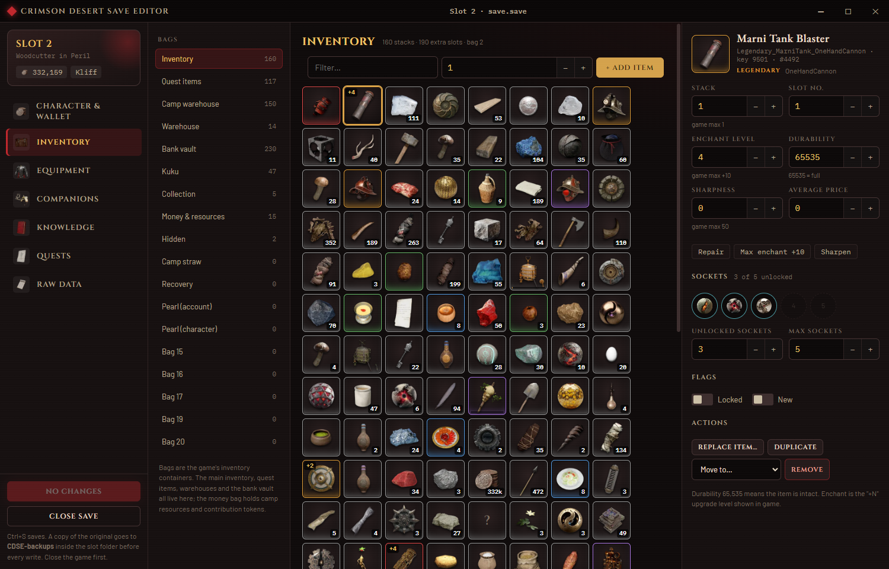
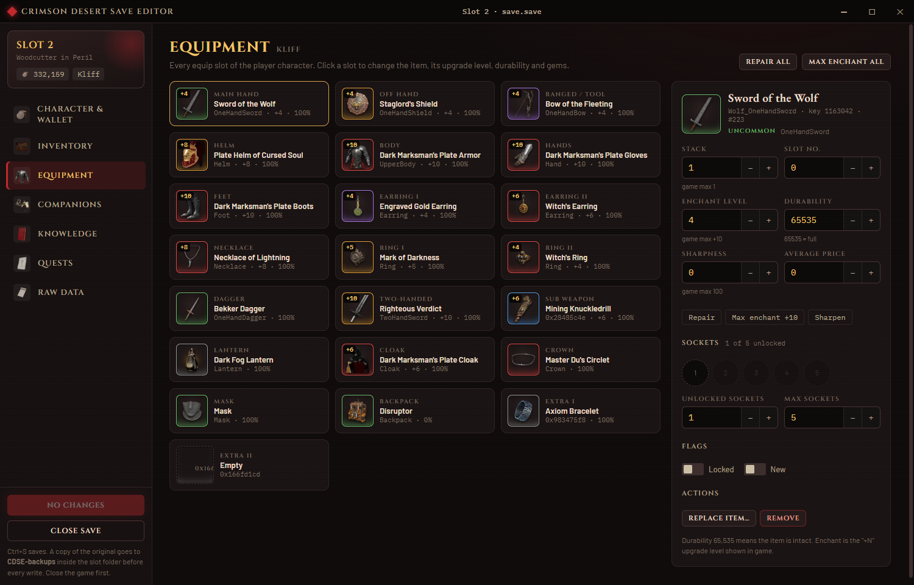

# Crimson Desert Save Editor (CDSE)

A desktop save editor for **Crimson Desert** — Windows and SteamOS / Steam Deck (Linux AppImage). Built with Electron + React + TypeScript, using the game's own item icons.



## Features

- **Character & wallet** — copper, bank deposit (gold bars in the vault), camp funds / food / timber / stone / weapons, contribution tokens, HP / MP, level and experience, unspent skill points, progress tracks
- **Inventory** — every bag in the save (inventory, quest items, camp warehouse, warehouse, bank vault, Kuku, collection, …). Add any of the 6,000 game items with a searchable picker (groups, tiers, icons), change stack sizes, enchant level, durability, sharpness, socket gems, lock / new flags; duplicate, move between bags, remove
- **Equipment** — all 22 equip slots of the player: swap items (the picker only offers what fits the slot), set the +N level, repair, fill sockets, one-click *Repair all* / *Max enchant all*
- **Companions** — mercenaries, mounts and pets: level, experience, HP / MP, skill points, name, dead / main flags, their equipment and inventories
- **Knowledge** — everything learned with its level; learn any knowledge, forget it, clear "new" marks
- **Quests** — mission and quest states (locked → reward received), add entries as completed, remove them
- **Raw data** — a tree of every value in the save with inline editing, so anything the screens don't cover can still be changed
- **Safety** — the editor re-parses its own output, re-opens the sealed file and checks the HMAC before writing; the original is copied to `CDSE-backups/` inside the slot folder on every write; `lobby.save`'s item counter is kept in sync so the game never reuses an item number



## Download

Grab the latest build from the Releases page (or build it yourself, see below):

| File | Platform |
| --- | --- |
| `CD Save Editor-<version>-portable.exe` | Windows, no install |
| `CD Save Editor-<version>-setup.exe` | Windows installer |
| `CD-Save-Editor-<version>-x86_64.AppImage` | SteamOS / Steam Deck / any Linux |

## Where the save is

**Windows**

```
C:\Users\<you>\AppData\Local\Pearl Abyss\CD\save\<steam id>\slot0\save.save
```

**SteamOS / Linux** (Proton prefix; the editor scans every Steam library for a prefix that contains the save folder)

```
~/.steam/steam/steamapps/compatdata/<app id>/pfx/drive_c/users/steamuser/AppData/Local/Pearl Abyss/CD/save/<steam id>/slot0/save.save
```

Each slot is a folder with `save.save` (the game state) and `lobby.save` (what the load screen shows). `slot0`–`slot2` are the manual slots, `slot100` and up are the game's rolling autosaves. Close the game before editing — it rewrites the slot on exit. If Steam Cloud reports a conflict afterwards, keep the **local** files.

### Steam Deck

1. Switch to Desktop Mode, download the `.AppImage`, right-click → Properties → Permissions → *Is executable* (or `chmod +x`).
2. Run it — it finds the saves automatically. Trackpads act as a mouse, `Steam + X` opens the keyboard.
3. Optional: add the AppImage as a non-Steam game to launch it from Game Mode.

## Development

```bash
npm install
npm run dev          # start the app with hot reload
npm run test:parser  # decrypt every slot, parse, re-serialize and verify the bytes are identical, then re-seal and re-open
npm run typecheck
npm run dist         # Windows: portable + installer exe into dist/
```

CI (`.github/workflows/build.yml`) builds Windows and Linux on every push and attaches the binaries to a GitHub release when a `v*` tag is pushed.

### Game data

`resources/game` holds 6,011 item icons (128 px WebP) and `gamedata.json` (items with names, groups, tiers, stack sizes, equip types, max enchant; equip slot tables per character; bag, character, knowledge, mission, quest, skill and store names). They are © Pearl Abyss and are bundled only so the editor can show what the game shows. `tools/build_gamedata.py` regenerates them from a checkout of [NattKh/CRIMSON-DESERT-SAVE-EDITOR-AND-GAME-MODS](https://github.com/NattKh/CRIMSON-DESERT-SAVE-EDITOR-AND-GAME-MODS) (MPL-2.0), whose lossless `iteminfo` dump, name tables and icon pack this project builds on. The save-file key material is also the one documented there.

### Save format

`save.save` / `lobby.save` are `SAVE` containers: a 128-byte header (version, sizes, 16-byte ChaCha20 nonce at 0x1A, HMAC-SHA256 at 0x2A) followed by the payload, which is LZ4-block-compressed and then ChaCha20-encrypted; the HMAC covers the compressed bytes. Inside is Pearl Abyss's reflect container: a schema of every type with its fields (name, type, kind, size), a table of root blocks and the blocks themselves. Each object is a presence bitmask followed by its written fields; vectors are always present (`01` = empty, `00` + count + elements), inline objects carry a locator with the absolute payload offset and a trailing payload size, pointer-vector elements are numbered. The parser/writer lives in [`src/shared/parc.ts`](src/shared/parc.ts), the container crypto in [`src/shared/cdcrypto.ts`](src/shared/cdcrypto.ts).

Item numbers (`_itemNo`) are allocated from a counter stored in `lobby.save` (`_generateNo`); the editor bumps it when it creates items.

## License

MIT for the editor's own code. Game assets belong to Pearl Abyss; this is an unofficial fan tool, not affiliated with Pearl Abyss.
